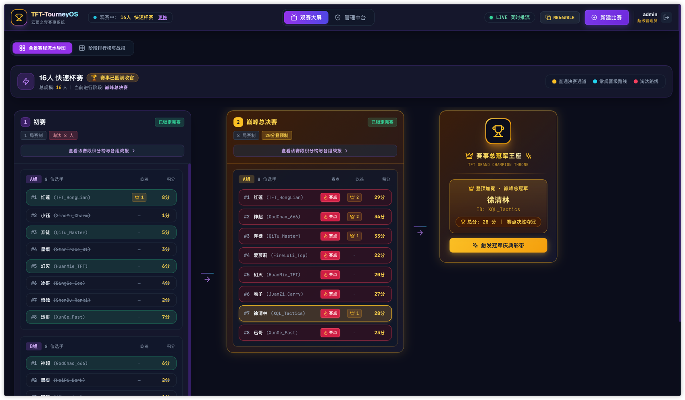
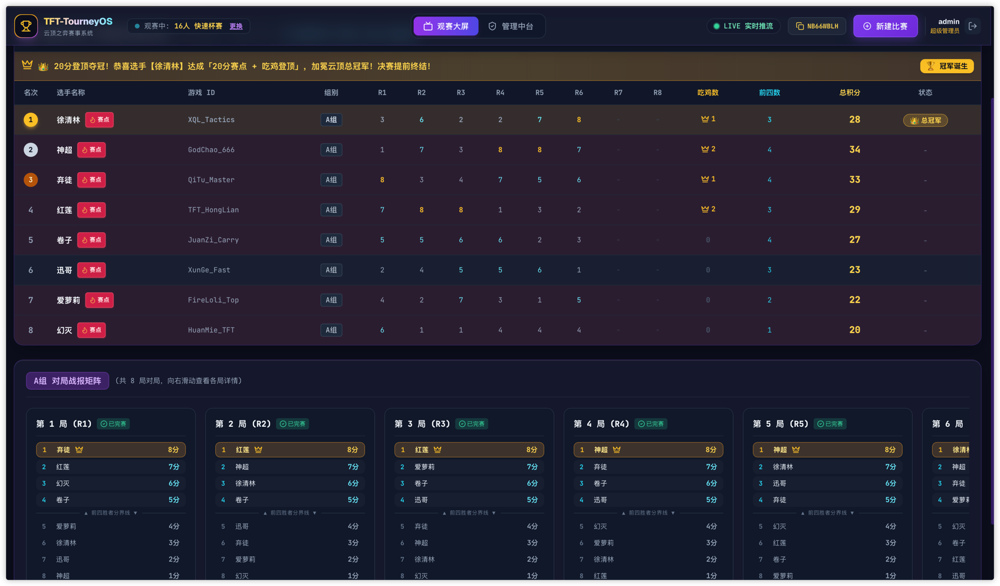
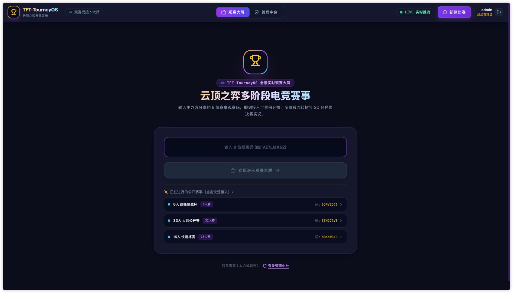

# 🏆 云顶之弈电竞赛事管理系统 (TFT TourneyOS)

<p align="center">
  
  
  
  
  
  
  
  
</p>

现代化、全流程闭环的云顶之弈（TFT）多阶段锦标赛编排与实时观赛系统。支持多租户独立办赛、动态赛制流水线编排、8 人房间蛇形/随机分组、裁判极速比分录入、积分继承计算、20 分登顶决赛机制与实时大屏数据推流 (SSE)。

> 🤖 **AI-Native 说明**：本项目全栈架构设计、前后端业务代码、动态赛程数学闭包算法、20分登顶制结赛状态机、暗夜电竞质感 UI 交互以及自动化 CI/CD 容器化流水线均由 **Google DeepMind 的 Gemini 大模型** 协作生成与全链路端到端调优构建。

---

## 📸 界面效果预览 (Screenshots)

### 1. 全景赛程流水导图与巅峰冠军王座 (Spectator Mindmap)


### 2. 裁判录分与赛段流转管理工作台 (Admin Workbench)


### 3. 公开大厅与观赛码接入大门 (Spectator Gate)


---

## 🌟 核心特性

- **多租户与权限体系**：支持超级管理员与多赛事主办方（基于 Sa-Token 鉴权与租户数据隔离）。
- **6 大官方标准赛制快捷预设模板**：
  1. `8人 巅峰单决战`（单桌决胜，20分登顶制）
  2. `16人 经典双轮杯赛`（初赛 ➔ 8人总决赛20分登顶制）
  3. `16人 职业突围双败赛`（初赛4人直通+4人淘汰+8人突围 ➔ 8人总决赛）
  4. `32人 大师标准赛`（32进16 ➔ 16进8半决赛带底分 ➔ 8人总决赛）
  5. `32人 TOC 官方四阶段赛`（TOC/JOC 官方同款四阶段双败突围制）
  6. `64人 全国公开赛`（海选 ➔ 初赛 ➔ 半决 ➔ 8人总决赛）
- **动态赛程流水线与数学闭包强校验**：
  - 支持任意 8 的倍数规模选手（8/16/24/32/48/64/128+）。
  - 自动保障各赛段晋级人数为 8 的倍数，且最终恰好汇聚 8 位选手进入决赛。
- **20 分登顶赛制与自动夺冠结赛闭环**：
  - 决赛积分达到 20 分后激活登顶资格（🔥 赛点），首位取得第一名的选手即刻登顶夺冠。
  - 自动加冕冠军王座、自动锁定终局赛段、标记赛事完赛，并拦截后续录分防误操作。
- **分组控制与微调**：
  - 支持蛇形排位（Snake Seeding）与随机打散分组。
  - 支持未开赛时微调两名选手跨组/组内互换。
  - 支持安全清除分组（有比分时防误触拦截）。
- **严格的状态流转安全防御**：
  - 赛段锁定与解锁机制：下游赛段存在分组或积分时严禁解锁当前赛段。
  - 名册锁定与单选手内联编辑。
- **选手在线自主报名与群发分享体系**：
  - 专属免密报名通道：选手打开链接即可填写昵称与游戏 ID 自助报名，满员实时拦截并展示花名册。
  - 一体化比赛宣发：后台一键复制包含「选手报名链接」与「观赛大屏链接」的格式化精美宣发文案。
  - 选手头像定制：提供 12 套动漫风格预设头像库，支持单选手微调与一键随机换头像。
- **电竞级暗夜视觉 UI (Cyber Esports)**：
  - 观众大屏免登录沉浸式观赛，赛点火焰微动效与登顶吃鸡图标分列严格纵向贯穿对齐。
  - 统一电竞主题毛玻璃弹窗与 Toast 通知体系，告别原生浏览器的生硬提示。
  - 采用 React Portal 全局挂载与多层叠图层隔离，彻底消除弹窗透光与层级遮挡问题。
  - 实时 SSE 毫秒级推流同步（含 15 秒定时心跳保活与翡翠绿 LIVE 在线监测）。
  - **极致极简 URL 体系**：自动省略 `view=admin`、`tab=details`、`stage=1`，仅保留分享短码（如 `/?v=WW4U9JCU`）。

---

## 🛠️ 技术栈

- **后端**：Java 17, Spring Boot 3.2, SQLite / MySQL 双引擎支持, MyBatis-Plus, Sa-Token, SSE (Server-Sent Events)
- **前端**：React 18, Vite, TypeScript, Tailwind CSS, Lucide Icons, Canvas Confetti
- **容器与部署**：Docker, Docker Compose, Nginx

---

## 🚀 快速启动

### 方案 A：单机极速启动 (默认 SQLite 免配置)

#### 1. 后端启动 (Spring Boot)
```bash
cd server
export JAVA_HOME=/Library/Java/JavaVirtualMachines/jdk-17.0.10.jdk/Contents/Home
mvn clean compile
mvn spring-boot:run
```
> **提示**：系统默认使用 SQLite 零配置数据库，首次启动将自动建表并加载初始账号与规则！

#### 2. 前端启动 (React + Vite)
```bash
cd client
npm install
npm run dev
```
前端默认运行在 `http://localhost:3000`。

---

### 方案 B：生产级 MySQL 模式启动

1. 在 MySQL 中创建数据库并执行初始化脚本：
   * 结构脚本：[`sql/schema-mysql.sql`](file:///Users/rankai/www/yunding-cup/sql/schema-mysql.sql)
   * 初始种子数据：[`sql/seed-data.sql`](file:///Users/rankai/www/yunding-cup/sql/seed-data.sql)
2. 启动 Spring Boot 时指定 active profile 为 `mysql`：
   ```bash
   cd server
   export SPRING_PROFILES_ACTIVE=mysql
   export MYSQL_HOST=localhost
   export MYSQL_PORT=3306
   export MYSQL_DB=yunding_cup
   export MYSQL_USER=root
   export MYSQL_PASSWORD=your_password
   mvn spring-boot:run
   ```

---

### 方案 C：Docker 单镜像 (All-in-One) 极速运行

整个系统支持多阶段打包为**单个轻量级全栈镜像**（内置前端静态资源、后端 API、SQLite 数据存储与 SSE 推流）：

#### 方式 1：Docker Compose 一键启动
```bash
docker-compose up -d --build
```

#### 方式 2：本地编译并运行单镜像
```bash
docker build -t tft-tourneyos .
docker run -d -p 8080:8080 -v $(pwd)/data:/app/data --name tft-tourneyos tft-tourneyos
```

#### 方式 3：从 GitHub Packages (GHCR) 直接拉取预编译镜像
```bash
docker run -d -p 8080:8080 -v $(pwd)/data:/app/data --name tft-tourneyos ghcr.io/rank97/yunding-cup:latest
```
容器启动后，浏览器直接打开 `http://localhost:8080` 即可使用！

---

---

## 🔑 默认账号

- **超级管理员**：`admin` / `123456`
- **普通主办方**：`user` / `123456`
- **参赛选手 / 游客观众**：无需登录即可通过报名链接自主报名或通过大屏链接实时观战！

---

## 📚 接口全景清单 (RESTful API & SSE)

### 1. 认证与账号接口 (`/api/v1/auth`)
| 方法 | 路径 | 权限 | 说明 |
| :--- | :--- | :--- | :--- |
| `POST` | `/api/v1/auth/login` | 公开 | 用户名密码登录（返回 Sa-Token） |
| `POST` | `/api/v1/auth/register` | 公开 | 注册普通主办方账号（多租户独立空间） |
| `GET` | `/api/v1/auth/info` | 需登录 | 获取当前登录用户信息与角色 |
| `PUT` | `/api/v1/auth/password` | 需登录 | 修改当前登录账号的密码（需验证原密码） |
| `POST` | `/api/v1/auth/logout` | 需登录 | 退出登录 |

### 2. 赛事管理接口 (`/api/v1/tournaments`)
| 方法 | 路径 | 权限 | 说明 |
| :--- | :--- | :--- | :--- |
| `GET` | `/api/v1/tournaments` | 需登录 | 获取当前用户有权管理的赛事列表 |
| `GET` | `/api/v1/tournaments/{id}` | 需登录 | 获取赛事详情（包含全部赛段配置） |
| `POST` | `/api/v1/tournaments` | 需登录 | 创建新赛事（执行动态赛程闭包强校验） |
| `PUT` | `/api/v1/tournaments/{id}` | 需登录 | 更新赛事信息与赛规参数 |
| `DELETE` | `/api/v1/tournaments/{id}` | 需登录 | 删除赛事 |

### 3. 赛段与选手流转接口 (`/api/v1/stages` & `/api/v1/players`)
| 方法 | 路径 | 权限 | 说明 |
| :--- | :--- | :--- | :--- |
| `GET` | `/api/v1/tournaments/{tId}/players` | 需登录 | 获取赛事名册选手列表 |
| `POST` | `/api/v1/tournaments/{tId}/players/batch` | 需登录 | 批量导入选手名册 |
| `POST` | `/api/v1/tournaments/{tId}/players` | 需登录 | 单独录入参赛选手（支持头像） |
| `PUT` | `/api/v1/players/{pId}` | 需登录 | 更新单个选手的姓名、游戏 ID 或自定义头像 |
| `DELETE` | `/api/v1/players/{pId}` | 需登录 | 删除指定选手 |
| `GET` | `/api/v1/stages/{sId}` | 需登录 | 获取赛段分组及房间小局明细 |
| `POST` | `/api/v1/stages/{sId}/grouping` | 需登录 | 赛段一键分组（`mode=SNAKE` / `RANDOM`） |
| `POST` | `/api/v1/stages/{sId}/clear-grouping` | 需登录 | 清除赛段分组房间（有比分时防误触拦截） |
| `POST` | `/api/v1/stages/{sId}/swap-players` | 需登录 | 跨组/组内两名选手席位微调互换 |
| `POST` | `/api/v1/stages/{sId}/lock` | 需登录 | 手动锁定赛段（成绩固化） |
| `POST` | `/api/v1/stages/{sId}/unlock` | 需登录 | 解锁赛段（下游有比分时安全防御拦截） |
| `POST` | `/api/v1/stages/{sId}/advancement` | 需登录 | 单独调整选手的晋级/直通/淘汰状态 |
| `POST` | `/api/v1/stages/{sId}/auto-advancement`| 需登录 | 根据当前赛段总分自动分配晋级状态 |

### 4. 对局录分与裁判接口 (`/api/v1/match-rounds`)
| 方法 | 路径 | 权限 | 说明 |
| :--- | :--- | :--- | :--- |
| `GET` | `/api/v1/match-rounds/{rId}/players` | 需登录 | 获取小局对局选手与现有排名数据 |
| `POST` | `/api/v1/match-rounds/{rId}/records` | 需登录 | 录入小局成绩（1~8名自动换算8~1分，决出冠军自动结赛） |
| `POST` | `/api/v1/match-rounds/{rId}/reset` | 需登录 | 重置小局比分（作废重赛） |

### 5. 公开报名、观赛与大屏推流接口 (`/api/v1/public`)
| 方法 | 路径 | 权限 | 说明 |
| :--- | :--- | :--- | :--- |
| `GET` | `/api/v1/public/tournaments` | 公开 | 获取公开赛事大厅列表 |
| `GET` | `/api/v1/public/score-rules` | 公开 | 查询系统中所有可用的积分规则模板列表 |
| `GET` | `/api/v1/public/tournaments/{shareCode}/signup-info` | 公开 | 获取指定赛事的公开报名概况与选手花名册 |
| `POST` | `/api/v1/public/tournaments/{shareCode}/signup` | 公开 | 选手自主在线公开免密报名参赛（支持头像） |
| `GET` | `/api/v1/public/tournaments/{shareCode}/overview` | 公开 | 获取大盘全景动态流程图谱与冠军王座 |
| `GET` | `/api/v1/public/tournaments/{shareCode}/stages/{sId}/leaderboard` | 公开 | 获取指定赛段积分榜明细 |
| `GET` | `/api/v1/public/tournaments/{shareCode}/stages/{sId}/group-details` | 公开 | 获取指定赛段各组战报矩阵 |
| `GET` | `/api/v1/public/tournaments/{shareCode}/stream` | 公开 | **SSE 实时推流长连接**（支持 15s 心跳保活与多事件广播） |

