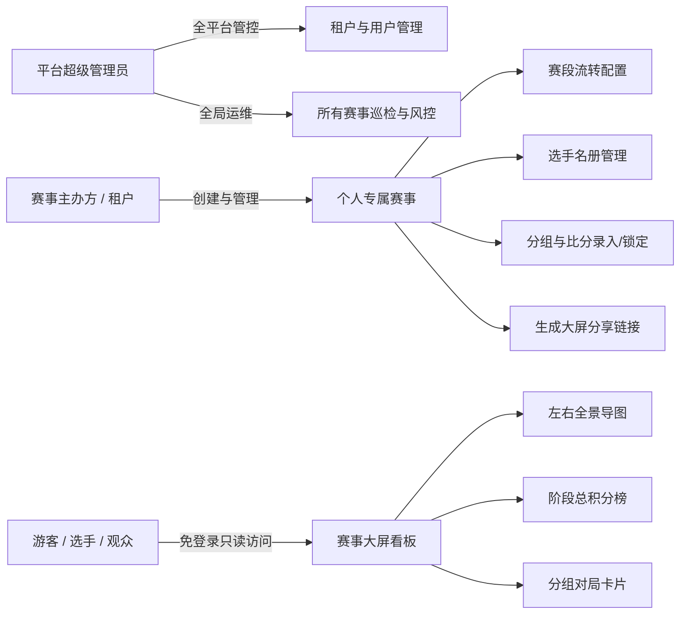
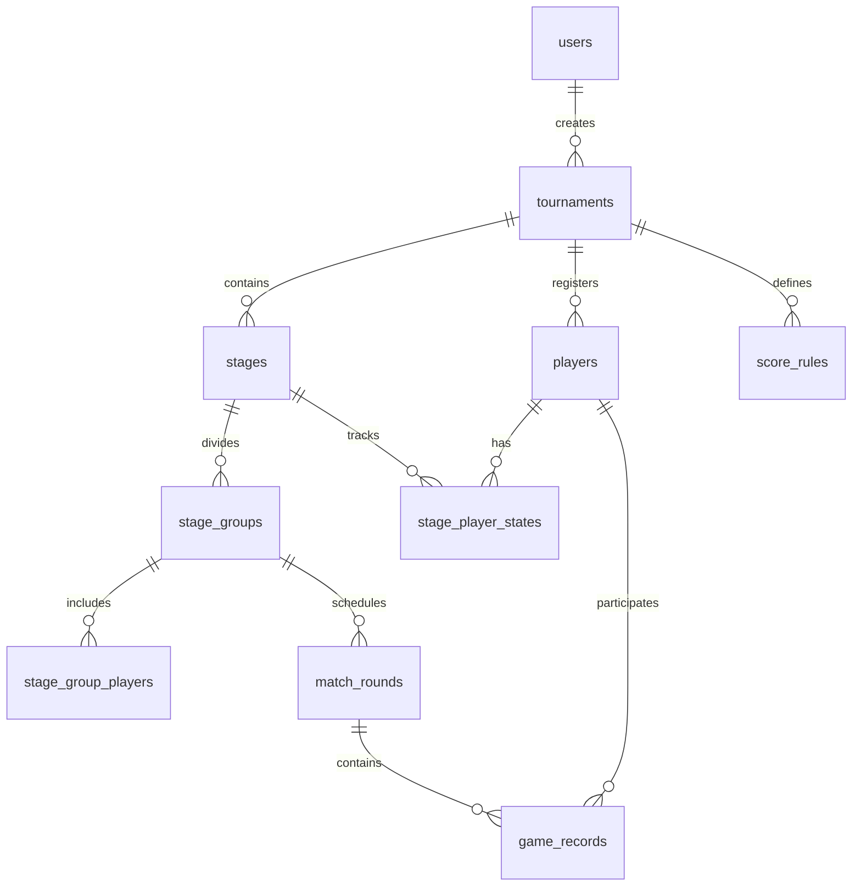
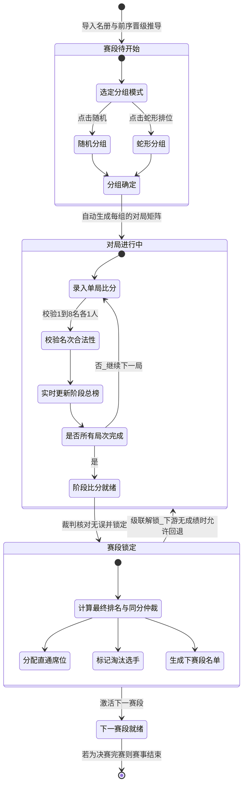
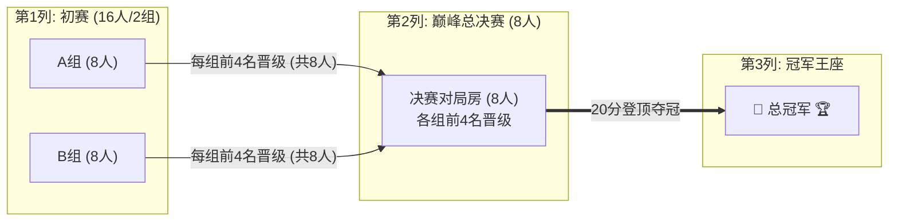
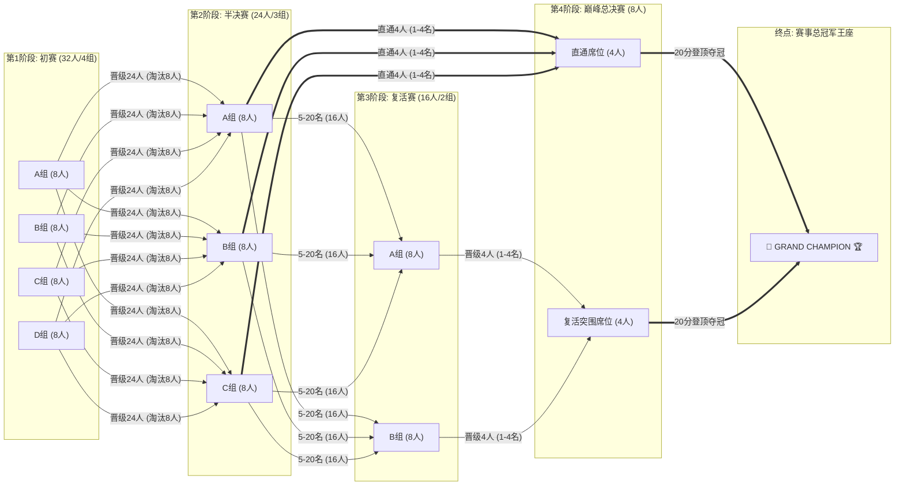
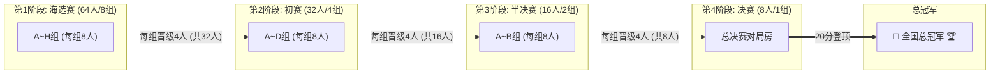
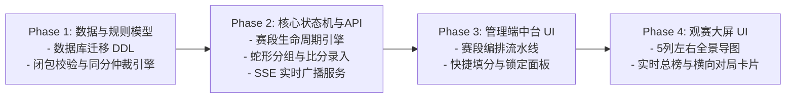

# 云顶之弈赛事管理系统 (TFT-TourneyOS)
## 需求规格说明书 (SRS) 与 详细设计方案 (LLD)

---

## 目录
1. [系统概述与核心特性](#一系统概述与核心特性)
2. [多租户与权限体系设计](#二多租户与权限体系设计)
3. [赛事规则体系与数学模型](#三赛事规则体系与数学模型)
4. [数据库详细设计 (DDL & ER 图)](#四数据库详细设计-ddl--er-图)
5. [赛程状态机与流转引擎](#五赛程状态机与流转引擎)
6. [后端核心 API 规范](#六后端核心-api-规范)
7. [前端交互与大屏视觉设计规范](#七前端交互与大屏视觉设计规范)
8. [开发与实施路线图](#八开发与实施路线图)

---

## 一、系统概述与核心特性

### 1.1 系统定位
**TFT-TourneyOS** 是一套专为《英雄联盟：云顶之弈 (Teamfight Tactics)》电竞赛事打造的多租户、高可用赛事管理与实时观赛系统。

系统核心支持**任意规模人数（8的任意倍数：16人、24人、32人、48人、64人、128人...）**与**任意自定义赛段（海选、初赛、突围、半决、复活、决赛等）的动态编排流转**与大屏自动化渲染。

### 1.2 核心特性矩阵

| 特性分类 | 核心能力说明 |
| :--- | :--- |
| **动态人数与拓扑编排** | 参赛总人数支持任意 $8 \times K$ 规模，管理者自由配置 $M$ 个赛段，系统自动验证数学闭包 |
| **多租户与隔离** | 每个主办方拥有独立赛事空间，游客通过短码 (`share_code`) 免登录观赛，数据物理/逻辑强隔离 |
| **双界面极简交互** | **管理员中台**（赛程编排、选手录入、蛇形/随机分房、快捷填分）与 **游客大屏看板**（只读实时全景） |
| **动态全景思维导图** | 前端根据赛事配置动态计算列数与分组数，自左向右生成响应式流水线导图与直通流光连线 |
| **电竞级规则引擎** | 支持自定义积分规则、官方同分仲裁链、决赛 20 分登顶制（Checkpoint）与最大局数熔断 |
| **实时比分广播** | 基于 SSE (Server-Sent Events) 机制，裁判提交成绩后大屏毫秒级静默翻牌更新 |

---

## 二、多租户与权限体系设计

### 2.1 角色与权限模型 (RBAC)



### 2.2 数据安全与隔离策略
1. **多租户隔离**：所有业务表均绑定 `tenant_id` 与 `tournament_id`，后端拦截器强校验归属权。
2. **防脏写与幂等录入**：单局成绩基于 `(match_round_id, rank)` 与 `(match_round_id, player_id)` 建立物理唯一约束。
3. **数据软删除防灾备**：赛事与赛段表引入 `is_deleted`，防止误触导致历史数据丢失。

---

## 三、赛事规则体系与动态流转拓扑引擎

### 3.1 动态赛段流转与数学闭包校验
系统支持任意规模的动态赛程编排，设赛事总赛段序列为自定义列表 `[S1, S2, ..., SM, S_Final]`：

1. **初始总人数约束**：`初始人数 N(S1) = 8 * K` (K >= 1，如 16, 24, 32, 48, 64, 128 人等)。
2. **常规阶段动态流转公式**：对于任意非决赛赛段 `Si` (1 <= i <= M)：
   * **输入人数**：`N(Si)`（对应动态生成 `N(Si) / 8` 个对局房间）
   * **直通决赛人数**：`D(Si) >= 0`
   * **淘汰人数**：`E(Si) >= 0`
   * **流转至下一赛段人数**：`N(S_next) = N(Si) - D(Si) - E(Si)`
   * **合法性断言**：`N(S_next)` 必须满足能够被 8 整除（即 `N(S_next) % 8 == 0`）。
3. **决赛 8 人闭包终结公式**：
   * 汇总所有前置赛段的直通人数 + 最后一轮突围赛晋级人数必须**恒等于 8 人**：
     ```text
     总直通人数之和 + 最后一阶段晋级人数 == 8
     即: Σ D(Si) + ( N(SM) - D(SM) - E(SM) ) ≡ 8
     ```
   * 管理员在 UI 上配置赛程时，系统后端实时校验此闭包方程，不合规时红字精准提示错误赛段。

### 3.2 赛段分组策略
1. **组内固定打满机制**：赛段开始时确定分组（每组 8 人），整个阶段内选手在**固定组内打完全部局数**。
2. **随机分组 (Random)**：执行 Fisher-Yates 算法打散均分。
3. **蛇形排位分组 (Snake Seeding)**：依据前序名次按蛇形折返分发（如 24 人分 3 组：A 组为 [1,6,7,12,13,18,19,24] 名）。

### 3.3 积分、弃权与同分仲裁算法
* **默认积分映射**：
  * 第 1~8 名依次对应：`8分, 7分, 6分, 5分, 4分, 3分, 2分, 1分`。
* **弃权处理**：弃权或掉线选手，裁判在当局直接记为**第 8 名（1分）**。
* **阶段总积分计算**：
  ```text
  选手阶段总积分 = 继承底分 (若开启) + 当前阶段各局得分之和
  注：赛事第一赛段 (Stage 1) 为初始赛段，无历史前置成绩，系统固定不开启“继承底分”选项（底分恒为0）。
  ```
* **同分仲裁严格判定链**（多名选手总积分相同时逐级向下比对）：
  1. **第一优先级**：**当前赛段内**第 1 名（吃鸡/登顶）局数多者优先；
  2. **第二优先级**：**当前赛段内**前 4 名（吃分）局数多者优先；
  3. **第三优先级**：当前赛段最后一局（Rx）单局成绩名次靠前者优先；
  4. **第四优先级**：当前赛段倒数第二局（Rx-1）单局成绩名次靠前者优先（以此类推）；
  5. **第五优先级**：当前赛段最高单局名次靠前者优先；
  6. **确定性保底**：按选手 `player_id ASC` 字典序稳定排序（杜绝页面刷新名次闪烁）。

### 3.4 决赛 20 分登顶制 (Checkpoint Rule)
1. **赛点激活**：任意局结束后，累计总分 `>= 20 分` 的选手，状态置为 `MATCH_POINT`（赛点就绪）。
2. **冠军终结**：处于 `MATCH_POINT` 状态的选手在后续任意一局中获得 **第 1 名**，比赛**立即终结**，该选手夺得总冠军。
3. **2~8 名排位**：按累计总分降序排列（赛点选手优先于同分非赛点选手，同分按仲裁链比对）。
4. **最大局数熔断（可选）**：若达到设定最大局数（如 8 局）仍未产生登顶冠军，按当前总积分第一名直接获胜。

---

## 四、数据库详细设计 (DDL & ER 图)

### 4.1 实体关系图 (ER Diagram)



### 4.2 SQL DDL 建表语句 (PostgreSQL / MySQL 8.0 兼容)

```sql
-- 1. 用户与租户表
CREATE TABLE users (
    id VARCHAR(36) PRIMARY KEY,
    username VARCHAR(64) NOT NULL UNIQUE,
    password_hash VARCHAR(255) NOT NULL,
    role VARCHAR(20) NOT NULL DEFAULT 'ORGANIZER',
    created_at TIMESTAMP WITH TIME ZONE DEFAULT CURRENT_TIMESTAMP,
    updated_at TIMESTAMP WITH TIME ZONE DEFAULT CURRENT_TIMESTAMP
);

-- 2. 积分规则模板表
CREATE TABLE score_rules (
    id VARCHAR(36) PRIMARY KEY,
    tenant_id VARCHAR(36) NOT NULL,
    rule_name VARCHAR(64) NOT NULL,
    is_system_default BOOLEAN DEFAULT FALSE,
    score_mapping JSON NOT NULL, -- {"1": 8, "2": 7, "3": 6, "4": 5, "5": 4, "6": 3, "7": 2, "8": 1}
    created_at TIMESTAMP WITH TIME ZONE DEFAULT CURRENT_TIMESTAMP
);

-- 3. 赛事主表
CREATE TABLE tournaments (
    id VARCHAR(36) PRIMARY KEY,
    tenant_id VARCHAR(36) NOT NULL,
    title VARCHAR(128) NOT NULL,
    total_players INT NOT NULL,
    share_code VARCHAR(16) NOT NULL UNIQUE,
    status VARCHAR(20) NOT NULL DEFAULT 'DRAFT', -- DRAFT, IN_PROGRESS, COMPLETED, ARCHIVED
    current_stage_id VARCHAR(36),
    is_deleted BOOLEAN NOT NULL DEFAULT FALSE,
    created_at TIMESTAMP WITH TIME ZONE DEFAULT CURRENT_TIMESTAMP,
    updated_at TIMESTAMP WITH TIME ZONE DEFAULT CURRENT_TIMESTAMP,
    FOREIGN KEY (tenant_id) REFERENCES users(id) ON DELETE CASCADE
);

-- 4. 赛事选手花名册
CREATE TABLE players (
    id VARCHAR(36) PRIMARY KEY,
    tournament_id VARCHAR(36) NOT NULL,
    name VARCHAR(64) NOT NULL,
    game_id VARCHAR(64) NOT NULL,
    avatar_url VARCHAR(255),
    initial_seed INT DEFAULT 0,
    created_at TIMESTAMP WITH TIME ZONE DEFAULT CURRENT_TIMESTAMP,
    FOREIGN KEY (tournament_id) REFERENCES tournaments(id) ON DELETE CASCADE,
    UNIQUE(tournament_id, game_id)
);

-- 5. 赛段配置表
CREATE TABLE stages (
    id VARCHAR(36) PRIMARY KEY,
    tournament_id VARCHAR(36) NOT NULL,
    name VARCHAR(64) NOT NULL, -- 初赛, 半决赛, 复活赛, 决赛
    stage_order INT NOT NULL,
    stage_type VARCHAR(20) NOT NULL DEFAULT 'STANDARD', -- STANDARD / CHECKPOINT_FINAL
    round_count INT NOT NULL DEFAULT 3,
    direct_to_final_count INT NOT NULL DEFAULT 0,
    eliminate_count INT NOT NULL DEFAULT 0,
    inherit_scores BOOLEAN NOT NULL DEFAULT FALSE,
    max_round_limit INT DEFAULT NULL,
    score_rule_id VARCHAR(36) NOT NULL,
    status VARCHAR(20) NOT NULL DEFAULT 'PENDING', -- PENDING, GROUPED, IN_PROGRESS, COMPLETED, LOCKED
    is_deleted BOOLEAN NOT NULL DEFAULT FALSE,
    created_at TIMESTAMP WITH TIME ZONE DEFAULT CURRENT_TIMESTAMP,
    updated_at TIMESTAMP WITH TIME ZONE DEFAULT CURRENT_TIMESTAMP,
    FOREIGN KEY (tournament_id) REFERENCES tournaments(id) ON DELETE CASCADE,
    FOREIGN KEY (score_rule_id) REFERENCES score_rules(id)
);

-- 6. 赛段内选手状态与累计积分表
CREATE TABLE stage_player_states (
    id VARCHAR(36) PRIMARY KEY,
    stage_id VARCHAR(36) NOT NULL,
    player_id VARCHAR(36) NOT NULL,
    carry_over_score INT NOT NULL DEFAULT 0,
    stage_score INT NOT NULL DEFAULT 0,
    total_score INT NOT NULL DEFAULT 0,
    first_place_count INT NOT NULL DEFAULT 0,
    top4_count INT NOT NULL DEFAULT 0,
    final_rank INT,
    advancement_status VARCHAR(20) DEFAULT 'NONE', -- NONE, ADVANCED, DIRECT_FINAL, ELIMINATED, CHAMPION
    is_match_point BOOLEAN DEFAULT FALSE,
    FOREIGN KEY (stage_id) REFERENCES stages(id) ON DELETE CASCADE,
    FOREIGN KEY (player_id) REFERENCES players(id) ON DELETE CASCADE,
    UNIQUE(stage_id, player_id)
);

-- 7. 赛段分组表
CREATE TABLE stage_groups (
    id VARCHAR(36) PRIMARY KEY,
    stage_id VARCHAR(36) NOT NULL,
    group_name VARCHAR(32) NOT NULL, -- A组, B组, C组
    group_order INT NOT NULL,
    created_at TIMESTAMP WITH TIME ZONE DEFAULT CURRENT_TIMESTAMP,
    FOREIGN KEY (stage_id) REFERENCES stages(id) ON DELETE CASCADE
);

-- 7.1 分组选手关联表
CREATE TABLE stage_group_players (
    id VARCHAR(36) PRIMARY KEY,
    stage_group_id VARCHAR(36) NOT NULL,
    player_id VARCHAR(36) NOT NULL,
    seed_index INT NOT NULL,
    FOREIGN KEY (stage_group_id) REFERENCES stage_groups(id) ON DELETE CASCADE,
    FOREIGN KEY (player_id) REFERENCES players(id) ON DELETE CASCADE,
    UNIQUE(stage_group_id, player_id)
);

-- 8. 具体对局表 (每一小局)
CREATE TABLE match_rounds (
    id VARCHAR(36) PRIMARY KEY,
    stage_group_id VARCHAR(36) NOT NULL,
    round_number INT NOT NULL,
    status VARCHAR(20) NOT NULL DEFAULT 'PENDING',
    created_at TIMESTAMP WITH TIME ZONE DEFAULT CURRENT_TIMESTAMP,
    FOREIGN KEY (stage_group_id) REFERENCES stage_groups(id) ON DELETE CASCADE,
    UNIQUE(stage_group_id, round_number)
);

-- 9. 单局对局明细成绩表
CREATE TABLE game_records (
    id VARCHAR(36) PRIMARY KEY,
    match_round_id VARCHAR(36) NOT NULL,
    player_id VARCHAR(36) NOT NULL,
    rank INT NOT NULL CHECK (rank BETWEEN 1 AND 8),
    score INT NOT NULL,
    created_at TIMESTAMP WITH TIME ZONE DEFAULT CURRENT_TIMESTAMP,
    updated_at TIMESTAMP WITH TIME ZONE DEFAULT CURRENT_TIMESTAMP,
    FOREIGN KEY (match_round_id) REFERENCES match_rounds(id) ON DELETE CASCADE,
    FOREIGN KEY (player_id) REFERENCES players(id) ON DELETE CASCADE,
    UNIQUE(match_round_id, rank),
    UNIQUE(match_round_id, player_id)
);

-- 核心索引
CREATE INDEX idx_tournaments_tenant ON tournaments(tenant_id);
CREATE INDEX idx_tournaments_share ON tournaments(share_code);
CREATE INDEX idx_stages_tourney ON stages(tournament_id, stage_order);
CREATE INDEX idx_group_players ON stage_group_players(stage_group_id, player_id);
CREATE INDEX idx_game_records_round ON game_records(match_round_id);
CREATE INDEX idx_stage_player_scores ON stage_player_states(stage_id, total_score DESC, player_id ASC);
```

---

## 五、赛程状态机与流转引擎



### 5.1 赛程锁定与单局修改规则
* **单局独立修改 (Single Round Edit)**：在赛段未锁定前，裁判可随时对**任意单局重新编辑或重置 (Remake)**，系统自动完成重算并实时同步总榜。
* **不可越级修改**：赛段配置只有在该阶段**尚未录入任何单局积分**时才允许修改属性。
* **向下锁定保护**：若赛段 $S_i$ 已锁定，且下游赛段 $S_{i+1}$ 已录入比分，则 $S_i$ 强只读。
* **安全级联回退**：回退 $S_i$ 前必须先级联清空下游所有已录入比分与名单。

---

## 六、后端核心 API 规范

### 6.1 管理端接口 (Admin API)

| 模块 | 方法 & 路径 | 说明 |
| :--- | :--- | :--- |
| **鉴权** | `POST /api/v1/auth/login` | 租户登录获取 JWT |
| **赛事** | `POST /api/v1/tournaments` | 创建赛事与赛段编排流 |
| **赛事** | `GET /api/v1/tournaments/:id` | 获取赛事详情与全流程状态 |
| **赛事** | `PUT /api/v1/tournaments/:id/stages` | 修改未开赛的赛段配置（带闭包校验） |
| **赛事** | `DELETE /api/v1/tournaments/:id` | 软删除赛事 (`is_deleted = true`) |
| **选手** | `POST /api/v1/tournaments/:id/players/batch` | 批量录入选手花名册 |
| **分组** | `POST /api/v1/stages/:stageId/grouping` | 执行分组计算 (`mode: SNAKE / RANDOM`) |
| **对局** | `POST /api/v1/match-rounds/:roundId/records` | 提交单局 1~8 名成绩（自动触发重算与 SSE） |
| **对局** | `PUT /api/v1/match-rounds/:roundId/records` | 单局成绩纠错与更新 |
| **对局** | `DELETE /api/v1/match-rounds/:roundId/records` | 单局作废与重赛 (Remake) |
| **赛段** | `POST /api/v1/stages/:stageId/lock` | 锁定当前赛段并生成下一赛段名单 |
| **赛段** | `POST /api/v1/stages/:stageId/unlock` | 级联解锁当前赛段 |

### 6.2 游客大屏公开接口 (Spectator API)

| 方法 & 路径 | 说明 |
| :--- | :--- |
| `GET /api/v1/public/tournaments/:shareCode/overview` | 获取左右全景导图数据（阶段流转、席位状态与虚位以待信息） |
| `GET /api/v1/public/tournaments/:shareCode/stages/:stageId/leaderboard` | 获取指定赛段总积分榜（底分、各局得分、吃鸡数、前四数、总分） |
| `GET /api/v1/public/tournaments/:shareCode/stages/:stageId/group-details` | 获取各组每局卡片的详细战报矩阵 |
| `GET /api/v1/public/tournaments/:shareCode/stream` | **SSE 实时事件流**，裁判保存比分后大屏毫秒级静默响应刷新 |

---

### 7.1 赛事全景导图（首页大屏 - 动态流式拓扑引擎）

首页大屏的思维导图**绝非静态写死**，而是由前端根据后台赛事的**参赛总人数与赛段配置列表动态计算并渲染**的响应式拓扑图：

#### 1. 动态布局渲染算法 (Dynamic Topology Engine)
* **总列数计算**：总列数 $= M$ (常规赛段数) $+ 1$ (巅峰总决赛) $+ 1$ (总冠军王座)。
* **各列分组卡片数**：第 $i$ 赛段的对局组数 $= N(S_i) / 8$（自动按 A组、B组、C组... 纵向堆叠渲染）。
* **动态连线与流光路由**：
  * **直通流光线 (`==>`)**：若当前阶段配置了 $D(S_i) > 0$，算法自动绘制一条金色贝塞尔曲线，跨过中间赛段直插决赛卡片的【直通席位区】。
  * **晋级流光线 (`-->`)**：常规晋级流向下一相邻赛段。
  * **虚位以待槽位**：若上游赛段尚未完赛，下游对应名额自动渲染为半透明 `⏳ 虚位以待 (来源: XX阶段 第X-X名)`。

---

#### 2. 多赛制规模动态渲染示例

##### 场景 A：16人 快速杯赛（初赛 16人 $\to$ 决赛 8人 $\to$ 冠军）


##### 场景 B：32人 经典四阶段赛程（初赛 $\to$ 半决赛 $\to$ 复活赛 $\to$ 决赛 $\to$ 冠军）


##### 场景 C：64人 大型全国公开赛（海选 64人 $\to$ 初赛 32人 $\to$ 半决 16人 $\to$ 决赛 8人）


#### 3. 导图视觉动效与交互规范：
1. **动态自适应视口**：前端组件基于 SVG / Canvas 自适应横向排列各阶段列，支持平滑缩放与鼠标拖拽平移。
2. **状态呼吸光晕**：当前正在进行的阶段高亮荧光外发光；已完赛节点置绿；未开启节点半透明置灰。
3. **“虚位以待”交互悬浮卡**：点击或悬停“虚位以待”席位，弹出该名额所有潜在争夺者名单与实时积分。
4. **冠军终结爆发粒子**：决赛 20 分登顶产生的瞬间，金色流光喷涌汇入最右侧王座，点亮冠军定妆照。


---

### 7.2 赛段详情：总积分榜 (Leaderboard Table)
位于赛段详情页上方，按同分仲裁规则实时渲染：

| 排名 | 状态标识 | 选手姓名 | 游戏召唤师 ID | 组别 | 初始底分 | R1 | R2 | R3 | R4 | R5 | 吃鸡数 | 前四数 | 总积分 |
| :---: | :---: | :---: | :---: | :---: | :---: | :---: | :---: | :---: | :---: | :---: | :---: | :---: | :---: |
| **1** | 👑 直通决赛 | 神超 | ShenChao#001 | A组 | +0 | 8 | 8 | 7 | 8 | 6 | 3 | 5 | **37** |
| **2** | 👑 直通决赛 | 红莲 | HongLian#002 | B组 | +0 | 7 | 8 | 8 | 5 | 8 | 3 | 5 | **36** |
| **3** | 👑 直通决赛 | 慎独 | ShenDu#003   | A组 | +0 | 8 | 6 | 7 | 7 | 7 | 1 | 5 | **35** |
| **4** | 👑 直通决赛 | 幻灭 | HuanMie#004  | C组 | +0 | 6 | 7 | 6 | 8 | 7 | 1 | 5 | **34** |
| **5** | 🔄 进复活赛 | 阿豪 | AHao#005     | B组 | +0 | 5 | 5 | 8 | 6 | 5 | 1 | 5 | **29** |
| ... | ... | ... | ... | ... | ... | ... | ... | ... | ... | ... | ... | ... | ... |
| **21**| ❌ 淘汰出局 | 选手X| PlayerX#021  | C组 | +0 | 2 | 1 | 2 | 3 | 1 | 0 | 0 | **9** |

---

### 7.3 赛段详情：分组单局卡片矩阵 (Horizontal Round Cards)
位于赛段详情页下方，**每组独立成行**，组内**每局为一个卡片**，多局支持横向平滑滚动：

* **A 组对局战报行**：
  * **[ R1 第一局卡片 ]**：🥇 1st 神超 (8分👑) ｜ 🥈 2nd 慎独 (7分) ｜ 🥉 3rd 阿豪 (6分) ｜ 4th 选手D (5分) --- *(前四分割线)* --- 5th 选手E (4分) ｜ 6th 选手F (3分) ｜ 7th 选手G (2分) ｜ 8th 选手H (1分)
  * **[ R2 第二局卡片 ]**：🥇 1st 慎独 (8分👑) ｜ 🥈 2nd 神超 (7分) ｜ ... ｜ 8th 选手G (1分)
  * ... ➡️ *(横向平滑滑动)*
* **B 组对局战报行**：
  * **[ R1 第一局卡片 ]** ｜ **[ R2 第二局卡片 ]** ｜ ...
* **C 组对局战报行**：
  * **[ R1 第一局卡片 ]** ｜ **[ R2 第二局卡片 ]** ｜ ...

---

### 7.4 裁判比分录入工作台
* **键盘极速填分**：录入弹窗支持数字键 `1~8` 一键快速指派名次，自动排重并实时折算积分。
* **单局即时保存**：单局录入完成点击保存，数据库事务自动重算总榜并通过 SSE 广播到大屏。

---

## 八、开发与实施路线图


